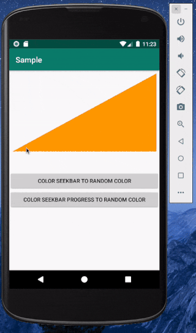

# TriangleSeekbar

It's simple lightweight Triangle Seekbar library 



[](https://jitpack.io/#agarasul/TriangleSeekbar)


### Attributes that you can change
All of this attributes also can be changed from code with relevant methods.

| Attribute | What it does | What type of argument it receives
| ------ | ------ | ------ |
| app:seekbarColor | color of seekbar | color (For example #b7b7b7) |
| app:seekbarLoadingColor | progress color of seekbar |  color (For example #b7b7b7) |
| app:textColor| progress text color | color (For example #b7b7b7) |
| app:textFontName | set font for progress text | font which should locate in assets/fonts folder |
| app:textFontSize | set font size for progress text | For example 14f |
| app:showProgress | Should progress text visible or not | true or false
| app:progressTextPosition | The position of progress text in the seekbar | Possible positions topLeft,topRight,bottomLeft,bottomRight,center |
| app:progress | Default progress for seekbar | value from 0.0 to 1.0

### Usage
	
``` xml

<az.rasul.triangleseekbar.TriangleSeekbar
            android:id="@+id/triangleSeekbar"
            android:layout_width="match_parent"
            android:layout_height="200dp"
            app:showProgress="true"
            app:progressTextPosition="center"
            app:textFontName="Roboto-Medium.otf"
            app:textFontSize="48sp"
            app:progress="0.5"
            app:seekbarColor="@color/colorPrimary"
            app:seekbarLoadingColor="@color/colorAccent"
            app:textColor="#E1BEE7"/>

```

In your code you add listener to progress change:

```java
TriangleSeekbar triangleSeekbar = findViewById(R.id.triangleSeekbar);
triangleSeekbar.setProgressListener(new TriangleSeekbar.ProgressListener() {
            @Override
            public void onProgressChange(float progress) {
                progressText.setText(String.valueOf(progress));
            }
        });

```

### Installation
----

Add it in your root build.gradle at the end of repositories:

	allprojects {
		repositories {
			...
			maven { url 'https://jitpack.io' }
		}
	}

Add the dependency

	dependencies {
	        implementation 'com.github.agarasul:TriangleSeekbar:latest.version'
	}
	
	


License
----
```
Copyright 2019 Rasul Aghakishiyev

Licensed under the Apache License, Version 2.0 (the "License");
you may not use this file except in compliance with the License.
You may obtain a copy of the License at

    http://www.apache.org/licenses/LICENSE-2.0

Unless required by applicable law or agreed to in writing, software
distributed under the License is distributed on an "AS IS" BASIS,
WITHOUT WARRANTIES OR CONDITIONS OF ANY KIND, either express or implied.
See the License for the specific language governing permissions and
limitations under the License.
```
